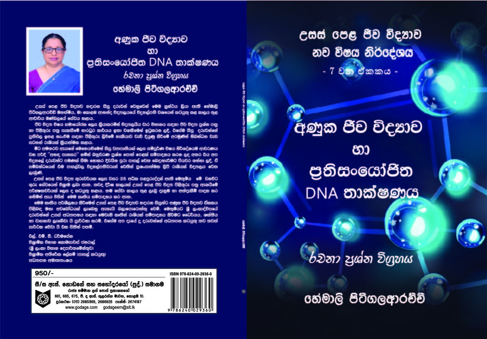
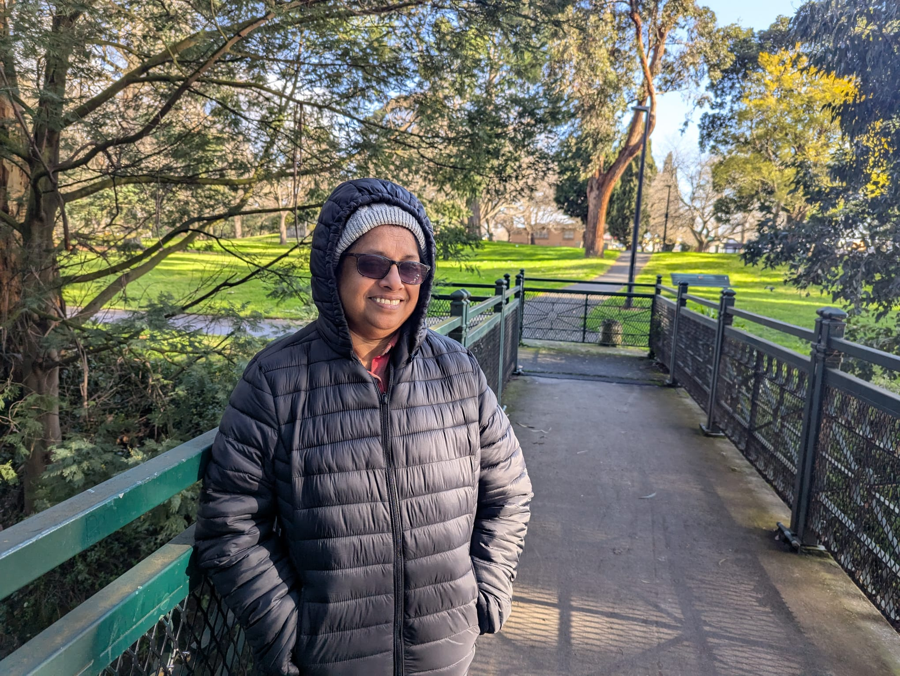
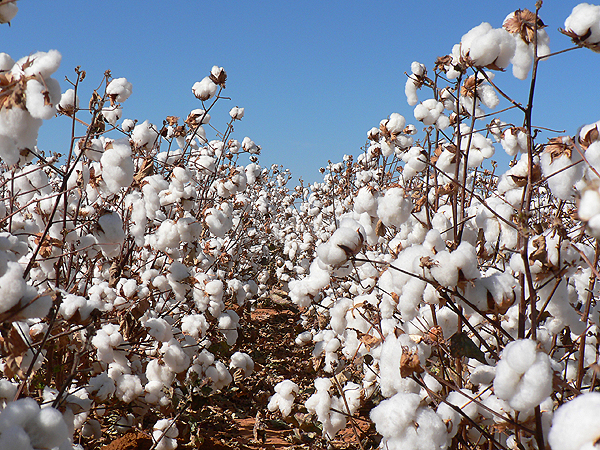
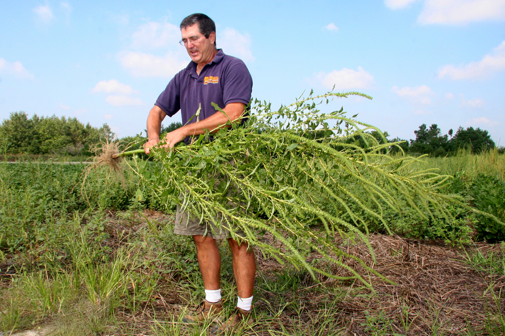
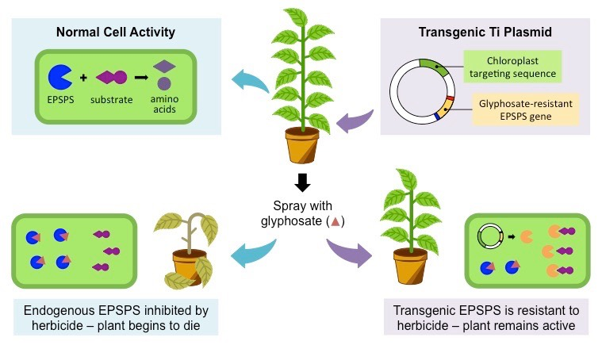
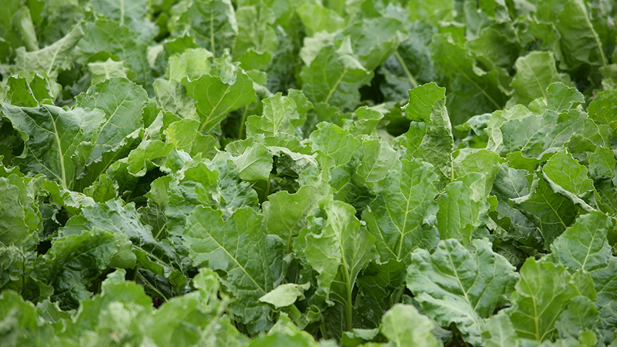

# අණුක ජීව විද්‍යාව හා ප්‍රතිසංයෝජිත DNA තාක්ෂණය

  
  
<em>ග්‍රන්ථයේ පිටකවරය</em>

# දරුවන්ට වදනක්...

<!-- 

  
  
<em>H.S. Pitigalaarachchi, Author of the book</em>

 -->

දිගු කාලීන ගුරු ජීවිතයේ විවිධ අත්දැකීම් අතර, සිසු පරපුර සමග කටයුතු කිරීම තුළින් ලබාගත් පන්නරය පළපුරුදු ගුරුවරයෙකු වීම සඳහා මා හට බෙහෙවින් ඉවහල් විය.සේවයෙන් විශ්‍රාම ගැනීමෙන් අනතුරුව ද,තව දුරටත් මා සතු දැනුම දරුවන් වෙත බෙදා දීමේ අභිලාෂය මෙවැනි ග්‍රන්ථයක් සම්පාදනය කිරීමෙහි ලා මා පෙළඹවීය.

දීර්ඝ කාලයක් වෙහෙසී වනපොත් කළ යුතු විෂය කරුණු වීඩියෝ අධ්‍යයනය මඟින් කෙටි කාලයක් තුළ ඉතා පහසුවෙන් අවබෝධ කර ගත හැකි බව අප කවුරුත් දන්නා සත්‍යයකි .නමුත් සුදුසු වීඩියෝ තෝරා ගැනීම දරුවන්ට පහසු කාර්යයක් නොවේ.එමෙන්ම මෙම වීඩියෝ වල විස්තර කිරීම් ඉංග්‍රීසි භාෂාවෙන් පැවතීමද ඇතැම් සිසුන්ට අධ්‍යයනය සඳහා බාධාවක් වේ.

ඉහත ගැටළු වලට විසඳුම් සපයමින් 'අණුක  ජීව විද්‍යාව හා ප්‍රතිසංයෝජිත DNA තාක්ෂණය - රචනා ප්‍රශ්න විග්‍රහය ' ලෙස ඔබ වෙත ඉදිරිපත් කරන ග්‍රන්ථය පරිහරණයේදී අත්වැලක් ලෙස යොදා ගැනීම සඳහා තෝරාගත් සුදුසු වීඩියෝ පට ඔබ වෙත ඉදිරිපත් කරන අතර, ඉදිරියේ දී ඒවායේ සිංහල පරිවර්තනද ඇතුළත් කිරීමට බලාපොරොත්තු වෙමි.

~ හේමාලි පිටිගලආරච්චි මහත්මිය ~

Note: අපගේ වෙබ්අඩවිය දැනට සකස් කරමින් පවතී. ඉතා ඉක්මනින් ඔබට සම්පූර්ණයෙන් භාවිතා කළ හැකි වනු ඇත!

# අන්තර්ජාලයෙන් තෝරා ගන්නා ලද video
## Video 1: DNA ප්‍රතිවලිතය
- [Video link > DNA ප්‍රතිවලිතය](https://www.youtube.com/embed/TNKWgcFPHqw)
<iframe width="560" height="315" src="https://www.youtube.com/embed/TNKWgcFPHqw" frameborder="0" allow="accelerometer; autoplay; encrypted-media; gyroscope; picture-in-picture" allowfullscreen></iframe>

<!-- 

Explaination in Sinhala 

DNA යනු තවත් ස්ත්‍රෑන්ඩ් දෙකකින් සමන්විත අණුයකි, ඒවා එකිනෙකට වටකුරු වන ද්විත්‍ය හෙලික්ස් ආකාරයකින් හැඩගැසී තිබේ. එක් ස්ත්‍රෑන්ඩ් එකක් රසායනික පදයෙන් හතරක් වන A, C, G සහ T යන අකුරු වලින් යුක්ත වූ අනුක්‍රමයකින් සාදා ඇති අතර, අනෙක් ස්ත්‍රෑන්ඩ් එකත් මේවාට සමානවී තිබේ. මේ මීටියාවන් ආපසු අනුලකිනුත් අනුක්‍රමයේ ඇති T ක් කොහේ හෝ තිබුණහොත්, එහි විරුද්ධ ස්ත්‍රෑන්ඩ් එකේ A ක් ඇත. එසේම, කොහේ හෝ C ක් තිබුණහොත්, අනෙක් ස්ත්‍රෑන්ඩ් එකේ G ක් ඇත.

 -->

## Video 2: DNA ප්‍රතිවලිතය - එන්සයිම ක්‍රියාකාරීත්වයේ විස්තර සහිතව
- [Video link > DNA ප්‍රතිවලිතය - එන්සයිම ක්‍රියාකාරීත්වයේ විස්තර සහිතව](https://www.youtube.com/embed/Qqe4thU-os8)
<iframe width="560" height="315" src="https://www.youtube.com/embed/Qqe4thU-os8" frameborder="0" allow="accelerometer; autoplay; encrypted-media; gyroscope; picture-in-picture" allowfullscreen></iframe>

<!-- 

Explaination in Sinhala 

අපි එについて බොහෝ දෙනා බසනවා - එය සෛලවල පූර්ණාංග නායකයා වන අතර ඔබේ ලක්ෂණයන් සදහා කොඩ් කරනවා.  
ඉස්සරම කොටසේදී - DNA එක සෛල වන්ස්කෘතියක සිදුවන්නේ මෙසේ, එය බෙදීලබා ගැනීමේදී නැවත ප්‍රජනනය වෙන්නේ DNA එක ලබාදීමක්, ඔබ අලුත් සහෝදර සෛලයට DNA එක ලබාදිය යුතුයි.
අවසාන එකක්.  

 -->

## Video 3: බැක්ටීරියා වර්ණදේහ ව්‍යුහය/ ඇසිරීම
- [Video link > බැක්ටීරියා වර්ණදේහ ව්‍යුහය/ ඇසිරීම](https://www.youtube.com/embed/30B0wGAID4o)
<iframe width="560" height="315" src="https://www.youtube.com/embed/30B0wGAID4o" frameborder="0" allow="accelerometer; autoplay; encrypted-media; gyroscope; picture-in-picture" allowfullscreen></iframe>

## Video 4: බැක්ටීරියා DNA ප්‍රතිවලිතය
 - [Video link > බැක්ටීරියා DNA ප්‍රතිවලිතය](https://www.youtube.com/watch?v=0Ha9nppnwOc)
<iframe width="560" height="315" src="https://www.youtube.com/embed/0Ha9nppnwOc" frameborder="0" allow="accelerometer; autoplay; encrypted-media; gyroscope; picture-in-picture" allowfullscreen></iframe>

## Video 5: DNA පිටපත් කිරීම හා පරිවර්තනය
 - [Video link > DNA පිටපත් කිරීම හා පරිවර්තනය](https://www.youtube.com/embed/8_f-8ISZ164)
<iframe width="560" height="315" src="https://www.youtube.com/embed/8_f-8ISZ164" frameborder="0" allow="accelerometer; autoplay; encrypted-media; gyroscope; picture-in-picture" allowfullscreen></iframe>

## Video 6: සීමාකාරී එන්සයිම
 - [Video link > සීමාකාරී එන්සයිම](https://www.youtube.com/embed/0iwWCFG4fHs)
<iframe width="560" height="315" src="https://www.youtube.com/embed/0iwWCFG4fHs" frameborder="0" allow="accelerometer; autoplay; encrypted-media; gyroscope; picture-in-picture" allowfullscreen></iframe>

## Video 7: DNA ක්ලෝනකරණය
 - [Video link > DNA ක්ලෝනකරණය](https://www.youtube.com/embed/MIfDx417SDs)
<iframe width="560" height="315" src="https://www.youtube.com/embed/MIfDx417SDs" frameborder="0" allow="accelerometer; autoplay; encrypted-media; gyroscope; picture-in-picture" allowfullscreen></iframe>

## Video 8: සදර්න් බ්ලොටින් ක්‍රමය
 - [Video link > සදර්න් බ්ලොටින් ක්‍රමය](https://www.youtube.com/embed/vBATs6Jhk4)
<iframe width="560" height="315" src="https://www.youtube.com/embed/vBATs6Jhk44" frameborder="0" allow="accelerometer; autoplay; encrypted-media; gyroscope; picture-in-picture" allowfullscreen></iframe>

## Video  9 : DNA ඇඟිලි සලකුණු මගින් දෙමාපිය පරීක්ෂාව
 - [Video link > DNA ඇඟිලි සලකුණු මගින් දෙමාපිය පරීක්ෂාව](https://www.youtube.com/embed/DiX5fPL4YGU)
<iframe width="560" height="315" src="https://www.youtube.com/embed/DiX5fPL4YGU" frameborder="0" allow="accelerometer; autoplay; encrypted-media; gyroscope; picture-in-picture" allowfullscreen></iframe>

## Video 10 : සමපාටික පිළියුම් (TR) සහ කුඩා සමපාටික පිළියුම් (STR)
 - [Video link > සමපාටික පිළියුම් (TR) සහ කුඩා සමපාටික පිළියුම් (STR)](https://www.youtube.com/embed/mVRcsw_SPT4)
<iframe width="560" height="315" src="https://www.youtube.com/embed/mVRcsw_SPT4" frameborder="0" allow="accelerometer; autoplay; encrypted-media; gyroscope; picture-in-picture" allowfullscreen></iframe>

---

# ඇතුළත් කර ඇති පින්තූර

## 1. DNV 
## 2. STR

# ඇතුළත් කර ඇති ඡායාරූප

## 1. සහලක්ෂණ / Syndromes

## 2. GMOs

### a. වල් නාශකයට ප්‍රතිරෝධය දක්වන බෝග වර්ග

  

    
  

  

    
  

  

    
  

  

    
  

  

    
  

  
 -->
    
  

  <!-- 

    
  

  

    
  

  

     -->
  <!-- 
 --> -->

